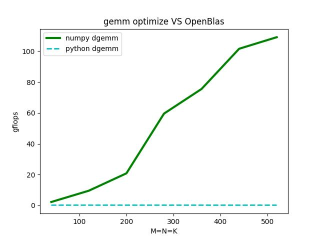

# <center>lab6-OpenMP并行编程</center>
<h5> <center>朱宏基&emsp;&emsp;220110131&emsp;&emsp;大二(上)</center> </h5>

### 实验环境:
- **OS版本**: Ubuntu 22.04.2 LTS
- **gcc版本**: 11.4.0
- **CPU**:
  1. 型号: AMD Ryzen 5 4600H with Radeon Graphics
  2. 频率: 均为 2994.389 MHz
  3. 核数: 12
- **内存**: 7.5 Gi

### DGEMM实现汇总
##### 1. C语言矩阵乘法的naive实现与openblas实现:
- 核心代码实现:
  ```c
  // naive实现
  void dgemm(int m, int n, int k, int beta,
            double A[][k], double B[][n], double C[][n]){
      for(int i=0; i< m;i ++){
          for(int j=0; j< n; j++){
              C[i][j] = beta*C[i][j];
              for(int p=0; p< k; p++){  
                  C[i][j] += A[i][p]*B[p][j]; 
               }
          }
      }
  }
  
  // openblas实现
  cblas_dgemm(CblasRowMajor, CblasNoTrans, CblasNoTrans, M, N, K, 1.0, (double *)A, K, (double *)B, N, 0.0, (double *)C, N);
  ```
- gflops曲线图与数据分析:
  
  由曲线图可以看出，naive实现的矩阵乘法一直较低，且随着数据规模增大有着减小的趋势，不过在规模较小时与openblas的gflops大致相同；而openblas实现的矩阵乘法随着数据规模的增大，gflops越来越大，即允许效率越来越高。

##### 2. python语言矩阵乘法的naive实现与调用numpy库实现:
- 核心代码实现:
  ```python
  # naive实现(纯python实现)
  for i in range(n):
      for j in range(n):
          for k in range(n):
              C[i][j] += A[i][k] * B[k][j]

  # numpy实现(调用numpy库)
  import numpy as np
  np_elapsed_time = 1000000000
  for i in range(0,nrepeats):
      start = time.time()
      C_np = np.dot(A, B)
      end  = time.time()
      tmp_time = end - start
      if np_elapsed_time > tmp_time:
          np_elapsed_time = tmp_time
  ```
- gflops曲线图与数据分析:
  
  由曲线图可以看出纯python实现的矩阵乘法随着矩阵规模增大，gflops几乎不变甚至略有下降；而调用numpy库实现的矩阵乘法随着矩阵规模增大gflops快速增大，说明允许效率越来越高。

##### 3. 多线程分块实现:
- 核心代码实现:
  ```c
  // 多线程实现
  void *dgemm_thread(void *arg)
  {
      long thread_id = (long)arg;
      int blocks_per_thread = lda / block_size / num_threads;
      int start_block = thread_id * blocks_per_thread;
      int end_block = (thread_id == num_threads - 1) ? (lda / block_size) : (start_block + blocks_per_thread);
  
      for (int i = 0; i < lda; i += block_size)
      {
          for (int j = 0; j < lda; j += block_size)
          {
              for (int k = 0; k < lda; k += block_size)
              {
                  dgemm_block(i, j, k);
              }
          }
      }
  
      pthread_exit(NULL);
  }
  ```
- gflops曲线图与数据分析:
  
  如gflops曲线图所示，多线程实现的矩阵乘法性能明显由于naive实现，但事实上，在矩阵规模较小时，性能反而会低于naive实现，因为创建线程的时间反而降低了运行速度。
  为此附上的源代码采用了小规模使用单线程计算，大规模使用多线程计算。

##### OpenMP实现:
- 核心代码实现:
  ```c
  // OpenMP实现
  void matrix_multiply(int m, int n, int k, double *A, double *B, double *C) {
      #pragma omp parallel for
      for (int i = 0; i < m; i++)
          for (int j = 0; j < n; j++)
              for (int p = 0; p < k; p++)
                  C[i * n + j] += A[i * k + p] * B[p * n + j];
  }
  ```
- gflops曲线图与数据分析:
  
  由曲线图可以看出，采用OpenMP实现的矩阵乘法GFLOPS呈现先增大后减小的走向，查阅资料得知，可能是由于缓存效果造成的影响：小规模的矩阵可能可以完全适应缓存，从而获得更好的性能，但随着矩阵规模的增大，缓存效果可能会减弱，导致性能下降。

### 遇到的问题:
本次实验并无遇到什么问题。